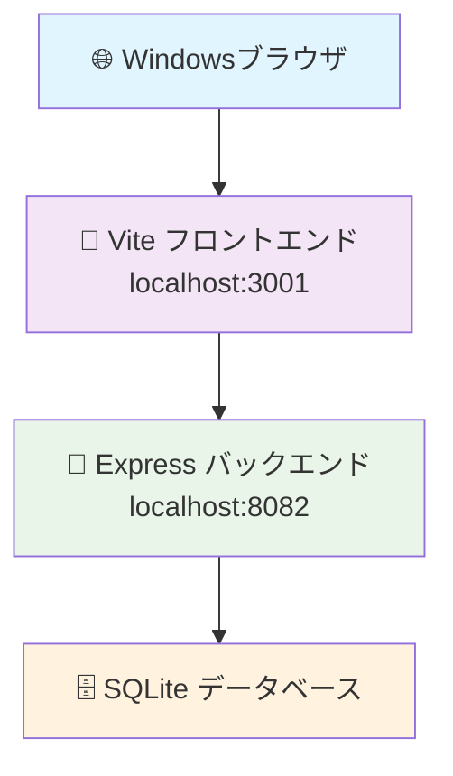

# 🏢 ITSM準拠IT運用システムプラットフォーム 運用マニュアル

<div align="center">


</div>

---

## 📋 目次

- [🚀 システム起動](#-システム起動)
- [🛑 システム停止](#-システム停止)
- [🌐 アクセス方法](#-アクセス方法)
- [🔑 ログイン情報](#-ログイン情報)
- [⚙️ システム構成](#️-システム構成)
- [🧪 動作確認](#-動作確認)
- [🔧 トラブルシューティング](#-トラブルシューティング)
- [📊 監視項目](#-監視項目)
- [🔄 日常運用](#-日常運用)
- [📞 サポート情報](#-サポート情報)

---

## 🚀 システム起動

### 🎯 推奨起動方法（ワンコマンド）

```bash
cd /mnt/e/ServiceGrid
npm run start:all
```

> 💡 **ポイント**: この方法で**フロントエンド**と**バックエンド**が同時に起動します

### 📱 起動確認画面

正常起動時の表示例：
```
🚀 ITSM システムを起動しています...
=======================================
🧹 既存のプロセスをクリーンアップ中...
🔧 バックエンドサーバーを起動中...
🎨 フロントエンドサーバーを起動中...
=======================================
✅ システム起動完了！

🌐 アクセスURL:
   フロントエンド: http://localhost:3001
   バックエンド:   http://localhost:8082

🔑 テストログイン:
   ユーザー名: admin
   パスワード: admin123

⏹️  停止方法:
   ./stop-all.sh を実行
   または Ctrl+C を2回押す
=======================================
```

### 🔄 個別起動方法

<details>
<summary>🔍 <strong>クリックして詳細を表示</strong></summary>

#### 方法A: npm経由

```bash
# ターミナル1: バックエンド起動
cd /mnt/e/ServiceGrid
npm run backend

# ターミナル2: フロントエンド起動（別ターミナル）
cd /mnt/e/ServiceGrid
npm run frontend
```

#### 方法B: 直接実行

```bash
# ターミナル1: バックエンド
cd /mnt/e/ServiceGrid/backend
npm start

# ターミナル2: フロントエンド
cd /mnt/e/ServiceGrid
npm run dev
```

</details>

---

## 🛑 システム停止

### ⚡ 推奨停止方法

```bash
npm run stop:all
```

### 🔧 その他の停止方法

| 方法 | コマンド | 用途 |
|------|----------|------|
| 🎯 **スクリプト** | `./stop-all.sh` | 推奨 |
| ⌨️ **キーボード** | `Ctrl+C` を2回 | 起動中ターミナル |
| 🧹 **強制停止** | `pkill -f "vite\|start-server"` | 緊急時 |

### ✅ 停止確認

停止完了時の表示：
```
🛑 ITSM システムを停止しています...
=======================================
🔧 バックエンドサーバーを停止中...
🎨 フロントエンドサーバーを停止中...
🧹 残存プロセスをクリーンアップ中...
✅ システム停止完了！
=======================================
```

---

## 🌐 アクセス方法

### 🖥️ **メインアクセスURL**

<table>
<tr>
<td align="center">
<h4>🎨 フロントエンド</h4>
<a href="http://localhost:3001">

</a>
<br>
<em>メインのWebアプリケーション</em>
</td>
<td align="center">
<h4>🔧 バックエンドAPI</h4>
<a href="http://localhost:8082">

</a>
<br>
<em>REST API サーバー</em>
</td>
</tr>
</table>

### 🧪 **APIテストエンドポイント**

| エンドポイント | 用途 | レスポンス |
|----------------|------|------------|
| 🏠 [http://localhost:8082](http://localhost:8082) | メイン | JSON形式のAPI情報 |
| 🏓 [http://localhost:8082/ping](http://localhost:8082/ping) | 疎通確認 | `pong` |
| 🔍 [http://localhost:8082/api/test](http://localhost:8082/api/test) | API動作確認 | 詳細システム情報 |
| ❤️ [http://localhost:8082/api/health](http://localhost:8082/api/health) | ヘルスチェック | システム状態 |

---

## 🔑 ログイン情報

### 👥 **デフォルトアカウント**

<table>
<tr>
<th>🏷️ ロール</th>
<th>👤 ユーザー名</th>
<th>🔐 パスワード</th>
<th>🛡️ 権限</th>
</tr>
<tr>
<td><span style="color: red;">🔴 **管理者**</span></td>
<td><code>admin</code></td>
<td><code>admin123</code></td>
<td>全機能アクセス</td>
</tr>
<tr>
<td><span style="color: orange;">🟡 **オペレータ**</span></td>
<td><code>operator</code></td>
<td><code>operator123</code></td>
<td>運用機能のみ</td>
</tr>
</table>

> ⚠️ **セキュリティ警告**: 本番環境では必ずパスワードを変更してください

### 🔐 **ログイン手順**

1. 🌐 http://localhost:3001 にアクセス
2. 👤 ユーザー名とパスワードを入力
3. 🚀 「ログイン」ボタンをクリック
4. ✅ ダッシュボードに自動転送

---

## ⚙️ システム構成

### 🏗️ **アーキテクチャ図**



### 💻 **技術スタック**

#### 🎨 **フロントエンド**
- 
- 
- 
- 

#### 🔧 **バックエンド**
- 
- 
- 

### 📁 **ディレクトリ構造**

```
ServiceGrid/
├── 📊 src/                    # フロントエンドソース
│   ├── 🧩 components/         # UIコンポーネント
│   ├── 📄 pages/              # ページコンポーネント
│   ├── 🔧 services/           # APIサービス
│   └── 📝 types/              # 型定義
├── 🔧 backend/                # バックエンドソース
│   ├── 🚀 start-server.js     # メインサーバー
│   ├── 🗄️ db/                 # データベース
│   └── 📦 node_modules/       # 依存関係
├── 🎬 start-all.sh           # 同時起動スクリプト
├── 🛑 stop-all.sh            # 停止スクリプト
└── 📚 運用マニュアル.md       # このファイル
```

---

## 🧪 動作確認

### ✅ **起動確認チェックリスト**

- [ ] 🔧 バックエンドサーバーが起動している
- [ ] 🎨 フロントエンドサーバーが起動している  
- [ ] 🌐 http://localhost:3001 にアクセス可能
- [ ] 🔧 http://localhost:8082 にアクセス可能
- [ ] 🔑 ログイン機能が正常動作
- [ ] 📊 ダッシュボードが表示される

### 🔍 **APIテスト手順**

#### 1️⃣ **疎通確認**
```bash
curl http://localhost:8082/ping
# 期待される結果: pong
```

#### 2️⃣ **ヘルスチェック**
```bash
curl http://localhost:8082/api/health
# 期待される結果: {"status":"✅ OK", ...}
```

#### 3️⃣ **ログインAPI確認**
```bash
curl -X POST http://localhost:8082/api/auth/login \
  -H "Content-Type: application/json" \
  -d '{"username":"admin","password":"admin123"}'
# 期待される結果: {"success":true,"token":"...", ...}
```

### 📱 **ブラウザテスト**

| テスト項目 | URL | 期待結果 |
|------------|-----|----------|
| 🏠 **メインページ** | http://localhost:3001 | ログインページ表示 |
| 🔧 **API確認** | http://localhost:8082 | JSON情報表示 |
| 🏓 **疎通確認** | http://localhost:8082/ping | "pong"表示 |
| ❤️ **ヘルスチェック** | http://localhost:8082/api/health | ステータス情報表示 |

---

## 🔧 トラブルシューティング

### ❌ **よくある問題と解決方法**

#### 🚫 **ポート使用中エラー**

**症状**: `Port 8082 is already in use!`

**解決方法**:
```bash
# 方法1: 停止スクリプト実行
npm run stop:all

# 方法2: プロセス強制終了
pkill -f "start-server\|vite"

# 方法3: ポート確認・終了
lsof -ti:8082 | xargs kill -9
```

#### 🌐 **ブラウザアクセス不可**

**症状**: "このページに到達できません"

**確認項目**:
1. ✅ サーバーが起動しているか確認
2. ✅ ポート番号が正しいか確認  
3. ✅ WSLとWindowsの通信確認

**解決方法**:
```bash
# サーバー状態確認
ps aux | grep "node\|vite"

# ポート確認
lsof -i :3001 -i :8082

# 再起動
npm run stop:all && npm run start:all
```

#### 🔑 **ログインできない**

**症状**: "Invalid credentials"

**確認項目**:
1. ✅ ユーザー名: `admin` または `operator`
2. ✅ パスワード: `admin123` または `operator123`
3. ✅ バックエンドAPIが正常動作しているか

**解決方法**:
```bash
# バックエンド動作確認
curl http://localhost:8082/api/health

# ログインAPI確認
curl -X POST http://localhost:8082/api/auth/login \
  -H "Content-Type: application/json" \
  -d '{"username":"admin","password":"admin123"}'
```

#### 💻 **依存関係エラー**

**症状**: `Module not found` または `npm install`失敗

**解決方法**:
```bash
# フロントエンド依存関係再インストール
cd /mnt/e/ServiceGrid
rm -rf node_modules package-lock.json
npm install

# バックエンド依存関係再インストール  
cd backend
rm -rf node_modules package-lock.json
npm install
```

### 🆘 **緊急時対応**

#### 🔥 **完全リセット手順**

```bash
# 1. 全プロセス停止
npm run stop:all
pkill -f "node\|vite"

# 2. ポートクリア
lsof -ti:3001,8082 | xargs kill -9

# 3. 依存関係再インストール
rm -rf node_modules package-lock.json
rm -rf backend/node_modules backend/package-lock.json
npm install
cd backend && npm install && cd ..

# 4. システム再起動
npm run start:all
```

---

## 📊 監視項目

### 🎯 **重要監視指標**

#### 🔧 **システムリソース**

| 項目 | 正常範囲 | 警告しきい値 | 確認方法 |
|------|----------|--------------|----------|
| 🖥️ **CPU使用率** | < 50% | > 80% | `top` または `htop` |
| 💾 **メモリ使用量** | < 70% | > 90% | `free -h` |
| 💽 **ディスク容量** | < 80% | > 95% | `df -h` |

#### 🌐 **アプリケーション**

| 項目 | 確認方法 | 正常状態 |
|------|----------|----------|
| 🎨 **フロントエンド応答** | http://localhost:3001 | 2秒以内にロード |
| 🔧 **バックエンド応答** | http://localhost:8082/ping | "pong"レスポンス |
| 🔑 **認証機能** | ログインテスト | 正常ログイン可能 |

### 📈 **ログ監視**

#### 🔍 **ログファイル場所**
```bash
# フロントエンドログ（ブラウザ開発者ツール）
# バックエンドログ（コンソール出力）

# プロセス確認
ps aux | grep "node\|vite"

# ポート使用状況
lsof -i :3001 -i :8082
```

---

## 🔄 日常運用

### 📅 **定期作業**

#### 🌅 **始業時チェック**
- [ ] 🚀 システム起動: `npm run start:all`
- [ ] 🧪 動作確認: 各URLアクセステスト  
- [ ] 🔑 ログインテスト: 管理者・オペレータアカウント
- [ ] 📊 リソース確認: CPU・メモリ使用量

#### 🌆 **終業時作業**  
- [ ] 💾 データバックアップ（必要に応じて）
- [ ] 🛑 システム停止: `npm run stop:all`
- [ ] 📝 運用ログ記録

#### 📊 **週次点検**
- [ ] 🔄 システム再起動テスト
- [ ] 📈 リソース使用量確認
- [ ] 🗄️ データベース状態確認
- [ ] 🔐 セキュリティ更新確認

### ⚙️ **メンテナンス作業**

#### 🔄 **システム更新**
```bash
# 1. システム停止
npm run stop:all

# 2. コード更新（git pullなど）
git pull origin main

# 3. 依存関係更新
npm install
cd backend && npm install && cd ..

# 4. システム再起動
npm run start:all
```

#### 🗄️ **データベースメンテナンス**
```bash
# データベースバックアップ
cp backend/db/itsm.sqlite backend/db/itsm_backup_$(date +%Y%m%d).sqlite

# データベース最適化
sqlite3 backend/db/itsm.sqlite "VACUUM;"
```

---

## 📞 サポート情報

### 🆘 **緊急時連絡先**

| 種別 | 連絡先 | 対応時間 |
|------|--------|----------|
| 🔧 **システム障害** | IT部門 | 24時間 |
| 🔐 **セキュリティ** | セキュリティ部門 | 24時間 |  
| 💼 **業務サポート** | ヘルプデスク | 平日 9:00-18:00 |

### 📚 **参考資料**

- 📖 [開発ガイド](DEVELOPMENT.md) - 開発者向け詳細情報
- 🔧 [API仕様書](docs/api.md) - REST API仕様
- 🚀 [デプロイガイド](docs/deployment.md) - 本番環境構築

### 🐛 **問題報告**

問題が発生した場合は、以下の情報を含めて報告してください：

```
🕐 発生時刻: YYYY/MM/DD HH:MM
🔍 問題内容: [具体的な症状]
🌐 アクセスURL: [問題が発生したURL]
👤 ユーザー: [使用していたアカウント]
🔧 実行コマンド: [実行していたコマンド]
💻 エラーメッセージ: [表示されたエラー]
```

### 💡 **改善提案**

システム改善のご提案やフィードバックをお待ちしています：
- 📧 Email: it-support@company.com
- 📝 Issue: GitHubリポジトリのIssue機能
- 💬 Teams: ITSMプロジェクトチャンネル

---

<div align="center">

### 🎉 お疲れ様でした！

**ITSM準拠IT運用システムプラットフォーム**へようこそ！<br>
このマニュアルがお役に立てれば幸いです。

---


**📅 最終更新: 2025年12月6日**

</div>