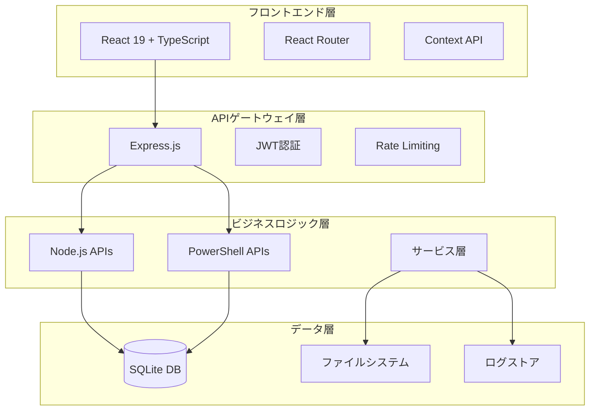
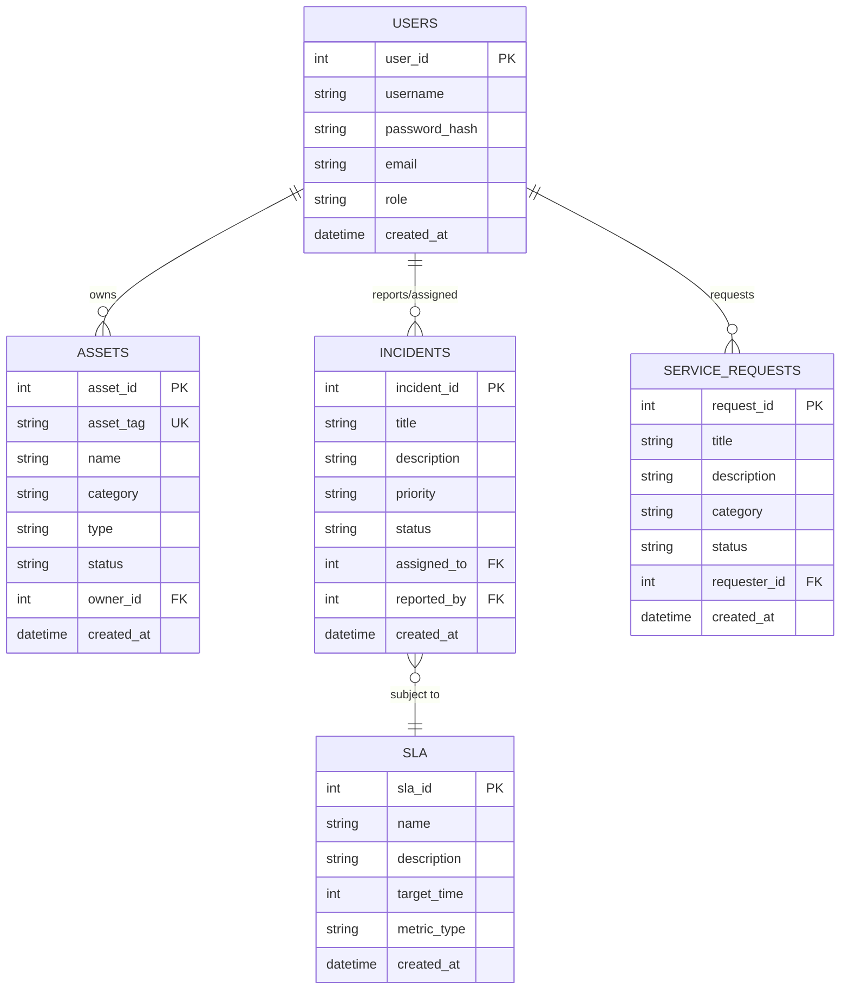
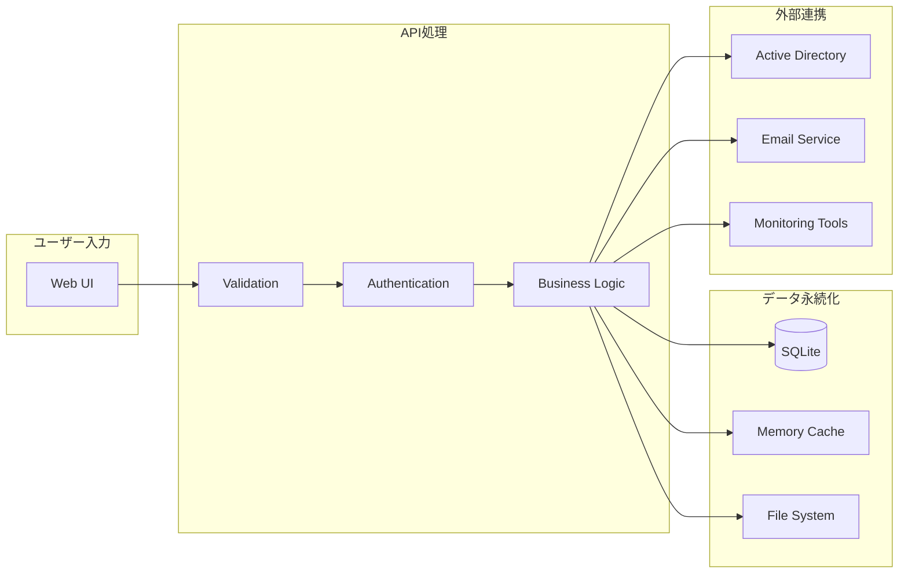
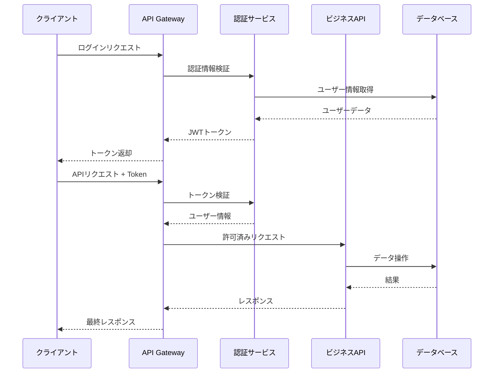
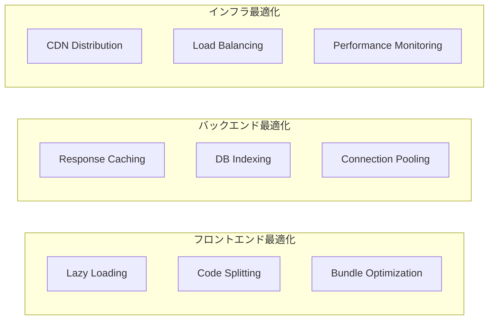
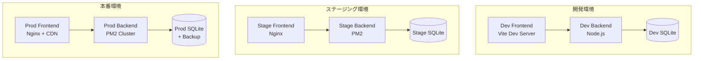
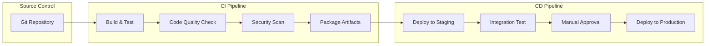
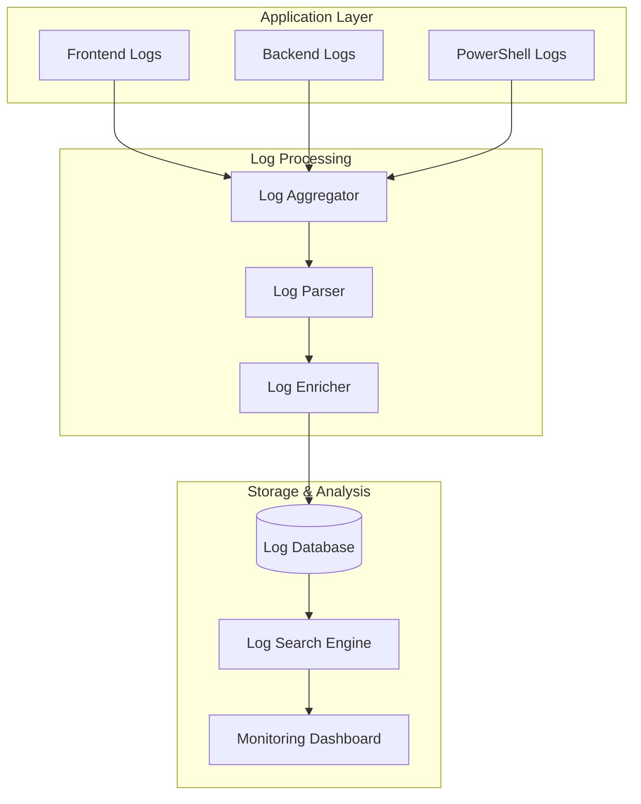
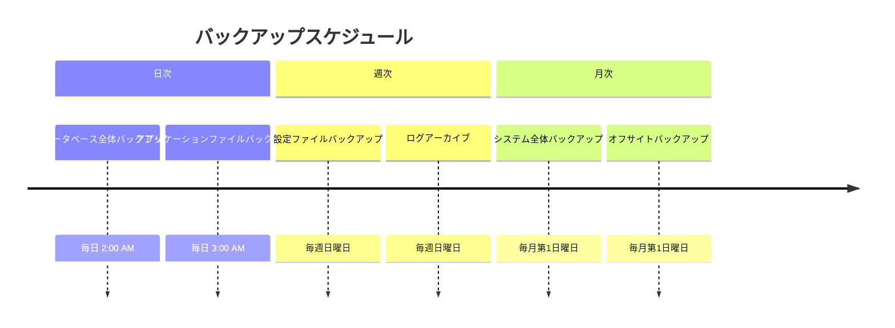

# ITSM Platform アーキテクチャ設計

## 概要

ITSM Platformは、ITサービスマネジメントのベストプラクティスに基づいた統合管理システムです。
モジュール化されたアーキテクチャで、拡張性と保守性を両立しています。

## システムアーキテクチャ

### 全体構成



### テクノロジースタック

| 層 | テクノロジー | 目的 |
|------|------------|------|
| **フロントエンド** | React 19 + TypeScript | UIコンポーネント、状態管理 |
| **ビルドツール** | Vite | 高速ビルド、HMR |
| **スタイリング** | Tailwind CSS | ユーティリティファーストCSS |
| **バックエンド** | Node.js + Express | REST API、ミドルウェア |
| **スクリプト** | PowerShell | Windows統合、システム連携 |
| **データベース** | SQLite | 組み込みデータベース |
| **認証** | JWT + bcrypt | トークンベース認証 |
| **テスト** | Jest + RTL | 単体テスト、結合テスト |

## モジュール設計

### フロントエンドモジュール

```
src/
├── components/          # 共通UIコンポーネント
│   ├── Layout.tsx
│   ├── CommonUI.tsx
│   └── ErrorBoundary.tsx
├── pages/               # ページコンポーネント
│   ├── DashboardPage.tsx
│   ├── AssetPage.tsx
│   └── IncidentPage.tsx
├── contexts/            # React Context
│   └── AuthContext.tsx
├── services/            # API通信サービス
│   ├── apiUtils.ts
│   └── authApiService.ts
├── types/               # TypeScript型定義
│   ├── common.ts
│   └── asset.ts
└── utils/               # ユーティリティ関数
    ├── errorHandler.ts
    └── formValidation.ts
```

### バックエンドモジュール

```
backend/
├── api/                 # REST APIエンドポイント
│   ├── assets.js        # 資産管理API
│   ├── incidents.js     # インシデントAPI
│   └── auth.js          # 認証API
├── middleware/          # Expressミドルウェア
│   └── auth.js          # JWT認証
├── modules/             # PowerShellモジュール
│   ├── Config.psm1
│   └── DBUtil.psm1
├── db/                  # データベース
│   ├── itsm.sqlite
│   └── schema.sql
└── utils/               # ユーティリティ
    └── errorHandler.js
```

## データモデル

### エンティティ関係図



### データフロー



## セキュリティアーキテクチャ

### 認証・許可モデル



### セキュリティ層

| 層 | セキュリティ対策 | 実装方法 |
|------|----------------|----------|
| **フロントエンド** | XSS対策 | ReactのSanitization |
| **通信** | HTTPS強制 | TLS 1.2+ |
| **API** | CSRF対策 | CSRF Token |
| **認証** | パスワードハッシュ化 | bcrypt |
| **データベース** | SQLインジェクション | Prepared Statements |
| **ファイル** | パストラバーサル | パス検証 |

## パフォーマンス設計

### スケーラビリティ戦略



### パフォーマンスメトリクス

| メトリクス | 目標値 | 測定方法 |
|-----------|--------|----------|
| **初期表示時間** | < 2秒 | FCP (First Contentful Paint) |
| **インタラクティブ時間** | < 3秒 | TTI (Time to Interactive) |
| **APIレスポンス** | < 500ms | エンドポイント監視 |
| **データベースクエリ** | < 100ms | クエリ実行計画 |
| **メモリ使用量** | < 512MB | システムモニタリング |

## デプロイメントアーキテクチャ

### 環境構成



### CI/CDパイプライン



## 監視・ログアーキテクチャ

### ログ集約システム



### メトリクス収集

| カテゴリ | メトリクス | 収集間隔 |
|----------|-----------|----------|
| **システム** | CPU, Memory, Disk | 1分 |
| **アプリケーション** | Response Time, Error Rate | 30秒 |
| **ビジネス** | User Activity, SLA Metrics | 5分 |
| **セキュリティ** | Failed Logins, Access Violations | リアルタイム |

## バックアップ・災害復旧

### バックアップ戦略



### 災害復旧手順

1. **緊急対応フェーズ** (0-4時間)
   - システム停止の確認
   - バックアップからの最低限機能復旧
   - ステークホルダーへの通知

2. **システム復旧フェーズ** (4-24時間)
   - 完全バックアップからの復元
   - データ整合性チェック
   - 機能テスト実行

3. **完全復旧フェーズ** (24-72時間)
   - 全機能の正常化
   - パフォーマンス調整
   - 本格運用再開

## 拡張性考慮事項

### スケールアウト戦略

1. **水平スケーリング**
   - ロードバランサー導入
   - データベースクラスタリング
   - CDN活用

2. **垂直スケーリング**
   - サーバースペック向上
   - メモリ増設
   - SSD化

3. **マイクロサービス化**
   - APIゲートウェイ導入
   - サービス分割
   - コンテナ化

### テクノロジーロードマップ

| フェーズ | 期間 | 主な改善 |
|----------|------|----------|
| **Phase 1** | 0-6ヶ月 | 現行アーキテクチャの安定化 |
| **Phase 2** | 6-12ヶ月 | マイクロサービス化開始 |
| **Phase 3** | 12-18ヶ月 | コンテナ化・オーケストレーション |
| **Phase 4** | 18-24ヶ月 | クラウドネイティブ化 |

---

**更新日**: 2025年6月14日  
**バージョン**: v1.0  
**作成者**: Claude Code AI Assistant